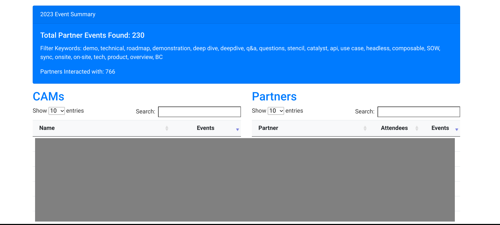

# Event Counter for ICS Files

## Overview
This tool parses calendar event data from `.ics` files and generates an HTML report categorizing attendees into internal and external participants based on their email domains. The report includes a count of events matching specified keywords, a list of these keywords, attendee statistics, and event details.



## Features
- **Keyword Filtering**: Events are filtered based on a list of pre-defined keywords.
- **Attendee Categorization**: Attendees are categorized as 'Internal' or 'External' based on their email domains.
- **Event Counting**: The tool counts all events that match the keyword criteria within a specified year.
- **Detailed Reporting**: Generates a detailed report including the total number of events found, unique external attendee count, and a breakdown of attendee participation.

## Usage
1. Define the keywords for event filtering in the `keywords` list.
2. Specify the email domain considered as 'internal'.
3. Run the script to parse the `.ics` file and generate the report.

## Report Sections
- **Event Summary**: Displays total events found, keywords used for filtering, and unique external attendee count.
- **Attendee Details**: Lists internal and external attendees, along with their participation count.
- **Filtered Events**: A detailed table of all events matching the filter, sortable by various criteria.

## Customization
Users can customize the following:
- The year for which the events are analyzed.
- The list of keywords used to filter events.
- The domain considered 'internal' to differentiate from external participants.

## Requirements
- Python 3
- `icalendar` Python package
- `jinja2` Python package
- `pytz` Python package for timezone conversions

## Installation
Install the required packages using `pip`:

```bash
pip install icalendar jinja2 pytz

```


## Contributing
Contributions to enhance the functionality or usability of this tool are welcome. Please ensure you follow the code of conduct and submit pull requests for any proposed changes.

## License
This project is licensed under the [MIT License](LICENSE.md).
